# 🚀 The Only AWS Project You'll Ever Need: Complete Data & AI Platform

<!-- Core Framework & Language -->
[](https://aws.amazon.com/cdk/)
[](https://www.python.org/)
[](https://www.typescriptlang.org/)
[](https://nextjs.org/)
[](https://fastapi.tiangolo.com/)
[](https://nodejs.org/)
[](https://spark.apache.org/)
[](https://aws.amazon.com/athena/)
[](https://www.docker.com/)
[](https://aws.amazon.com/)
[](https://ubuntu.com/)
[](https://powerbi.microsoft.com/)
[](LICENSE)


> **A production-ready AWS system integrating Data Engineering, Analytics, Data Science, MLOps, Web Applications, and Multi-Agent LLM, fully deployed with CDK self-mutating pipelines.**

---

## 📋 Table of Contents

- [Introduction](#-introduction)
- [Architecture Overview & Features](#-architecture-overview--features)
- [Installation](#-installation)
- [Data Engineering](#-data-engineering)
- [Data Science](#-data-science)
- [MLOps](#-mlops)
- [Full-Stack Web Application](#-full-stack-web-application)
- [Multi-Agent LLM](#-multi-agent-llm)
- [Cleanup](#-cleanup)
- [License](#-license)
- [Contact](#-contact)

---

## 🎥 Watch It In Action

Want to see the entire platform in action? Watch the quick demo:

[](https://youtu.be/eqc0p1wyRjE)

**Click to watch:** Real-time data flow, ML predictions, web dashboard & AI chatbot in 2 minutes

---


## 🎯 Introduction

This project demonstrates a complete, production-ready data and AI platform built entirely on AWS. It showcases AWS best practices across the entire data lifecycle—from real-time data ingestion to ML model deployment, from web applications to intelligent multi-agent systems.

### What Makes This Project Special

This is not just a collection of isolated AWS services—it's a **fully integrated, end-to-end platform** where every component works together seamlessly. The entire infrastructure is defined as code using AWS CDK, deployed through self-mutating pipelines, and follows enterprise-grade practices for security, monitoring, and cost optimization.

**Most importantly:** This project demonstrates how different data and AI roles collaborate in a **real production environment**. From a single GitHub repository, you'll see how:
- **Data Engineers** build real-time streaming pipelines and ETL workflows
- **Data Analysts** connect via Power BI to query processed data from Redshift Spectrum
- **Data Scientists** develop and train ML models using the prepared datasets
- **MLOps Engineers** deploy models to dev endpoints for testing, then promote to production with monitoring
- **Full-Stack Developers** build modern web applications that consume real-time predictions
- **AI Engineers** create intelligent multi-agent systems that understand the entire workflow

This is how modern data teams actually work together—not in silos, but as an integrated, collaborative workflow where each role builds upon the previous one.

**Key Highlights:**
- 🏗️ **Infrastructure as Code**: Everything deployed via AWS CDK self-mutating pipelines
- 🔄 **Real-Time Data Processing**: Kinesis streaming with Lambda processing
- 🤖 **Production ML**: SageMaker Pipelines with automated retraining
- 🚀 **MLOps Best Practices**: Multi-stage deployment, monitoring, drift detection, SHAP analysis
- 🌐 **Modern Web Stack**: Next.js 15 with SSG, WebSocket real-time updates
- 🧠 **Multi-Agent LLM**: Bedrock Agent Core with session management
- 📊 **Complete Observability**: CloudWatch dashboards, SNS notifications
- 💰 **Cost-Optimized**: Serverless-first architecture
- 👥 **Cross-Functional Collaboration**: See how 6 different roles work together in one project

### 💡 About This Project

This project was architected and developed by Kanit Vural as a complete, production-grade AWS data and AI platform. It unifies data engineering, analytics, machine learning, and MLOps using scalable cloud-native patterns and automation. The platform is designed not only as a real-world solution but also as a reusable reference architecture for modern data teams.

### Project Structure Overview

```
📦 aws-data-science-data-engineering-mlops-infra/
├── 📁 data_engineering/       # Real-time ingestion, ETL, analytics
├── 📁 data_science/           # ML model training pipeline
├── 📁 mlops/                  # Model deployment & monitoring
├── 📁 project_app/            # Next.js web application
├── 📁 multi_agent_llm/        # Intelligent agent system
├── 📄 app.py                  # CDK app entry point
├── 📄 cdk.json                # CDK configuration
├── 📄 Makefile                # Deployment commands
├── 📄 run.sh                  # Deployment bash scripts
├── 📄 .gitignore              
├── 📄 requirements.txt                 
└── 📄 README.md
```
### Project Pipelines

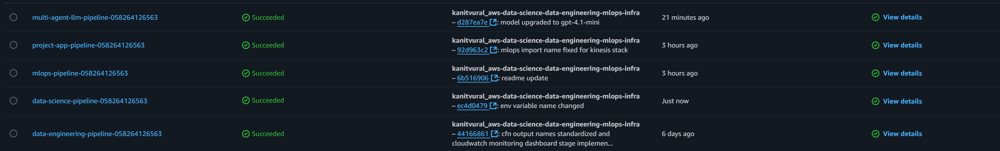

---

## 🏛️ Architecture Overview & Features


### Data Engineering Pipeline
**Real-time data streaming and batch ETL processing**

- ✅ **EC2** simulates historical flight data streaming
- ✅ **Kinesis Data Streams** → **Firehose** → **S3** for raw data ingestion
- ✅ **EventBridge** triggers hourly **Glue Spark ETL** jobs for data transformation
- ✅ **Glue Crawler** automatically discovers and catalogs schemas
- ✅ **Redshift Serverless** with Spectrum for analytics (Power BI integration)
- ✅ **CloudWatch Dashboard** for monitoring infrastructure
- ✅ **SNS** email notifications on job completion

### Data Science Workflow
**Automated ML pipeline with SageMaker**

- ✅ **Athena SQL** for stratified data sampling
- ✅ **SageMaker Processing** for feature engineering
- ✅ **SageMaker Clarify** for pre-training bias detection (parallel execution)
- ✅ **Hyperparameter Tuning** to find optimal XGBoost parameters
- ✅ **Final Training** with best parameters on combined train+val data
- ✅ **Conditional Approval** (RMSE < 15) before saving final model
- ✅ **Bring Your Own Container** with custom Docker training image
- ✅ **SNS** notification to MLOps team when model is ready

### MLOps Infrastructure
**Multi-stage deployment with automated monitoring**

- ✅ **Dev Endpoint** deployment for model validation
- ✅ **Step Functions** orchestrate automated testing and baseline generation
- ✅ **Model Registry** for version management
- ✅ **Production Endpoint** with auto-scaling (1-5 instances)
- ✅ **Manual Approval Gates** for model monitoring, SHAP analysis and Retraining
- ✅ **Model Monitoring** for data drift and quality checks
- ✅ **SHAP Analysis** for model explainability
- ✅ **Automated Retraining** trigger with monitoring data
- ✅ **Custom FastAPI Inference Container**

### Web Application
**Serverless Next.js 15 with real-time updates**

- ✅ **Next.js 15 SSG** hosted on **S3 + CloudFront**
- ✅ **API Gateway REST API** for authentication and Multi-Agent LLM chat
- ✅ **API Gateway WebSocket** for live data streaming
- ✅ **Cognito** authentication with HTTP-only cookies
- ✅ **Lambda** functions for preprocessing, inference, and data writing
- ✅ **DynamoDB** with TTL (1-hour automatic cleanup)
- ✅ **DynamoDB Streams** → WebSocket for real-time frontend updates
- ✅ **DynamoDB GSI** for optimized time-based queries for Multi-Agent LLM System
- ✅ **JWT refresh mechanism** (1h access token, 24h refresh token) stored in **HttpOnly cookies** for security.


### Multi-Agent LLM System
**Intelligent chatbot with Bedrock Agent Core**

- ✅ **Project Documentation Q&A** using OpenAI vector store
- ✅ **Real-Time Flight Statistics** agent tool queries from DynamoDB
- ✅ **Content Filtering & Privacy Protection** with Guardrail agent handoff
- ✅ **Session Management** with Cognito user isolation
- ✅ **Rate Limiting** (20 requests/minute per user)
- ✅ **Hybrid NoSQL + Pandas** querying strategy to simplify complex NoSQL queries
- ✅ **Automatic Token Extension** on activity

---

## 🛠️ Installation

### Prerequisites

| Tool | Version | Purpose |
|------|---------|---------|
| **Operating System** | Ubuntu 24.04 / WSL2 / macOS | Development environment |
| **Python** | 3.11+ | CDK and Lambda functions |
| **Node.js** | 22+ | Next.js frontend |
| **Docker** | 24.1.0 | Container builds |
| **AWS CLI** | 2.x | AWS operations |
| **AWS CDK** | 2.215.0 | Infrastructure as Code |
| **Make** | 4.x | Build automation |
| **Git** | 2.x | Version control |

### Step 1: System Setup

<details>
<summary><b>For Windows Users (WSL2)</b></summary>

```bash
# Install WSL2
wsl --install -d Ubuntu-24.04

# Update packages
sudo apt update && sudo apt upgrade -y

# Install required tools
sudo apt install -y build-essential git make curl
```
</details>

<details>
<summary><b>For macOS Users</b></summary>

```bash
# Install Homebrew (if not already installed)
/bin/bash -c "$(curl -fsSL https://raw.githubusercontent.com/Homebrew/install/HEAD/install.sh)"

# Install required tools
brew install git make
```
</details>

<details>
<summary><b>For Linux (Ubuntu 24.04)</b></summary>

```bash
# Update packages
sudo apt update && sudo apt upgrade -y

# Install required tools
sudo apt install -y build-essential git make curl
```
</details>

### Step 2: Install Docker

```bash
# Install Docker
curl -fsSL https://get.docker.com -o get-docker.sh
sudo sh get-docker.sh

# Add user to docker group
sudo usermod -aG docker $USER

# Start Docker service
sudo systemctl start docker
sudo systemctl enable docker

# Verify installation
docker --version
```

### Step 3: Install Zsh (Optional but Recommended)

```bash
# Install Zsh
sudo apt install -y zsh

# Install Oh My Zsh
sh -c "$(curl -fsSL https://raw.githubusercontent.com/ohmyzsh/ohmyzsh/master/tools/install.sh)"
```

### Step 4: Install Python Version Manager (pyenv)

```bash
# Install pyenv
curl https://pyenv.run | bash

# Add to shell configuration (~/.bashrc or ~/.zshrc)
echo 'export PYENV_ROOT="$HOME/.pyenv"' >> ~/.bashrc
echo 'command -v pyenv >/dev/null || export PATH="$PYENV_ROOT/bin:$PATH"' >> ~/.bashrc
echo 'eval "$(pyenv init -)"' >> ~/.bashrc

# Reload shell
exec $SHELL

# Install Python 3.9+
pyenv install 3.9.19
pyenv global 3.9.19

# Verify
python --version
```

### Step 5: Install AWS CLI

```bash
# Download and install AWS CLI v2
curl "https://awscli.amazonaws.com/awscli-exe-linux-x86_64.zip" -o "awscliv2.zip"
unzip awscliv2.zip
sudo ./aws/install

# Verify installation
aws --version
```

### Step 6: Configure AWS Credentials

**Create IAM User:**
1. Go to AWS Console → IAM → Users → Create User
2. Attach **AdministratorAccess** policy
3. Create access keys (Access Key ID & Secret Access Key)

**Create EC2 Key Pair:**
1. Go to AWS Console → EC2 → Key Pairs
2. Create Key Pair → Name: **demo**
3. Download `.pem` file

**Create AWS CodeStar Connection:**
1. Go to AWS Console → Developer Tools → CodePipeline → Settings → Connections
2. Create connection → GitHub → Authorize
3. Copy connection ARN: `arn:aws:codeconnections:eu-central-1:<ACCOUNT-ID>:connection/<CONNECTION-ID>`

**Configure AWS CLI:**
```bash
aws configure
# AWS Access Key ID: <YOUR_ACCESS_KEY>
# AWS Secret Access Key: <YOUR_SECRET_KEY>
# Default region name: eu-central-1
# Default output format: json
```

### Step 7: Install AWS CDK

```bash
npm install -g aws-cdk
cdk --version
```

### Step 8: Clone Repository

```bash
git clone https://github.com/kanitvural/aws-data-science-data-engineering-mlops-infra.git
cd aws-data-science-data-engineering-mlops-infra
git fetch --all
chmod +x run.sh
```

### Step 9: Setup Python Environment

```bash
# Create virtual environment
python -m venv .venv

# Activate
source .venv/bin/activate  # Linux/macOS
# .venv\Scripts\activate  # Windows

# Install dependencies
pip install aws-cdk-lib==2.215.0 constructs boto3
```

### Step 10: Configure cdk.json

Edit `cdk.json` and add to the `context` section:

```json
{
  "context": {
    "@aws-cdk/aws-lambda:recognizeLayerVersion": true,
    "githubConnectionArn": "arn:aws:codeconnections:eu-central-1:<YOUR-ACCOUNT-ID>:connection/<YOUR-CONNECTION-ID>",
    "key_name": "demo",
    "notification_email": "<YOUR-EMAIL>@example.com"
  }
}
```

---

## 🔧 Data Engineering


### Overview

The data engineering pipeline simulates a real-world scenario where historical flight data obtained from Kaggle is streamed from EC2 instances using a Python data simulator script, processed hourly by AWS Glue ETL jobs, and cataloged by AWS Glue Crawler to build a centralized metadata database. This metadata enables seamless SQL analytics through Amazon Athena and Redshift Spectrum, while clean and queryable data is exposed through Redshift Serverless for downstream use. As a result, data analysts can connect to the system using Power BI for business insights, and data scientists can sample data directly from the data lake to develop machine learning models.

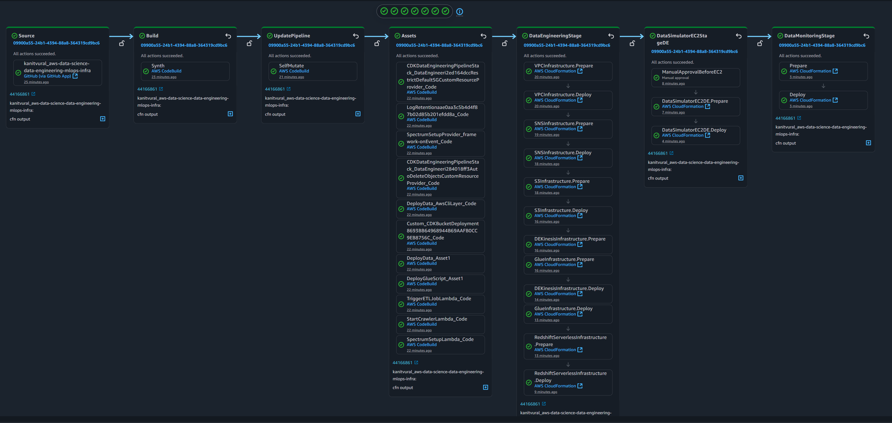

### Project Structure

```
data_engineering/
├── cdk_pipeline/
│   ├── cdk_data_engineering_pipeline.py
│   ├── data_engineering_stage.py
│   ├── ec2_stage.py
│   └── monitoring_stage.py
├── stacks/
│   ├── vpc_stack.py
│   ├── s3_stack.py
│   ├── kinesis_stack.py
│   ├── glue_stack.py
│   ├── redshift_stack.py
│   ├── ec2_stack.py
│   ├── monitoring_stack.py
│   └── sns_stack.py
├── lambda_funcs/
│   ├── setup_redshift_spectrum/
│   ├── start_crawler/
│   └── trigger_etl_job/
├── scripts/
│   └── spark_etl_job.py
└── data/
    └── flights_weather2022.csv
```

**Data Flow:**
1. **EC2** → Kinesis Data Streams → Firehose → **S3 (Raw Data Lake)**
2. **EventBridge** (hourly) → triggers Glue ETL Job
3. **Glue ETL Job** cleans data → saves as Parquet → **S3 (Processed)**
4. **Glue Crawler** infers schema → updates **Glue Data Catalog**
5. **SNS** sends email notification to data science team
6. **Redshift Spectrum** enables SQL queries from Power BI

### Dataset Information

**Source:** [Kaggle - Flights & Weather 2022](https://www.kaggle.com/datasets/iskorpittt/flights-weather-2022)

**Statistics:**
- **111,006 rows**, **29 variables**
- **First 6 months of 2022**
- **Airports:** SEA (Seattle) and PDX (Portland)

**Key Variables:**

| Variable | Description |
|----------|-------------|
| `year`, `month`, `day`, `hour`, `minute` | Date components (all 2022) |
| `dep_time`, `sched_dep_time` | Actual and scheduled departure |
| `arr_time`, `sched_arr_time`| Actual and scheduled arrival |
| `dep_delay (target)`, `arr_delay` | Delay in minutes |
| `carrier`, `airline` | Airline code and full name |
| `flight`, `tailnum` | Flight number and aircraft ID |
| `origin`, `dest` | Departure and arrival airports |
| `air_time`, `distance` | Flight duration and distance |
| `route`| Flight route |
| `temp`, `dewp`, `humid` | Temperature, dew point, humidity |
| `wind_dir`, `wind_speed`, `wind_gust` | Wind measurements |
| `precip`, `pressure`, `visib` | Precipitation, pressure, visibility |


### Deployment

```bash
git switch dataengineering
make bootstrap env=de
make deploy env=de
```

**Deployment Time:** ~20-30 minutes

### Power BI Integration


**Connection Steps:**
1. Open Power BI Desktop
2. Get Data → Amazon Redshift
3. Server: `<redshift-workgroup-endpoint>`
4. Database: `flightdb`
5. Username: `admin`
6. Password: `<secret-manager-password>`
7. Table: `flightdb.spectrum.flight_events`
8. Use `DirectQuery` mode

### Monitoring

The streaming infrastructure, including Amazon Kinesis Data Streams, Kinesis Firehose, EC2, and Redshift Serverless, is continuously monitored through a custom Amazon CloudWatch dashboard to ensure system reliability and real-time observability.

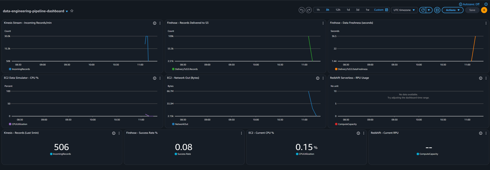

**Key Metrics:**
- Kinesis: IncomingRecords
- Firehose: DeliveryToS3Records, DeliveryToS3DataFreshness
- EC2: CPUUtilization, NetworkOut
- Redshift: ComputeCapacity

### Email Notification

- When Glue ETL job completes, data science team receives email with:

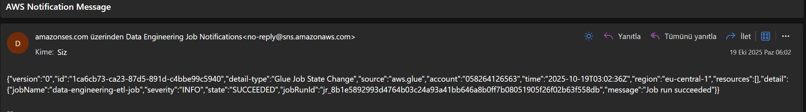

- When Redshift Serverless deployment completes, data analytics team receives email with:

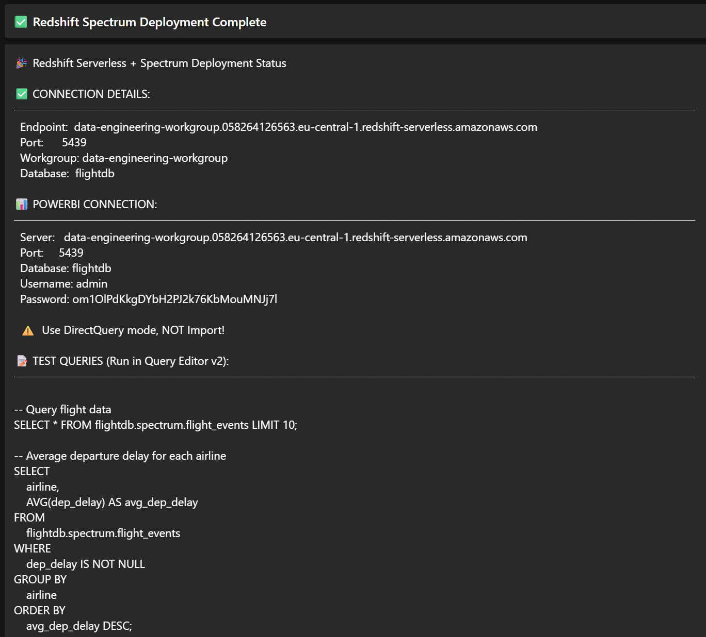

### Cleanup

```bash
make destroy env=de
```

**⚠️ Manual Cleanup:** If CloudFormation stack deletion fails due to a missing IAM role, follow these steps:

1. Copy the name of the missing IAM role from the error message.
2. Go to the **AWS Console → IAM** and create or update the role with **AdministratorAccess** permissions.
3. Attach the role to **CloudFormation**.
4. Retry deleting the stack in **CloudFormation**.


---

## 🧪 Data Science


### Overview

The data science pipeline automates the entire ML workflow—from data sampling to model training—using SageMaker Pipelines. The pipeline uses a **Bring Your Own Container** approach with a custom XGBoost training Docker image.

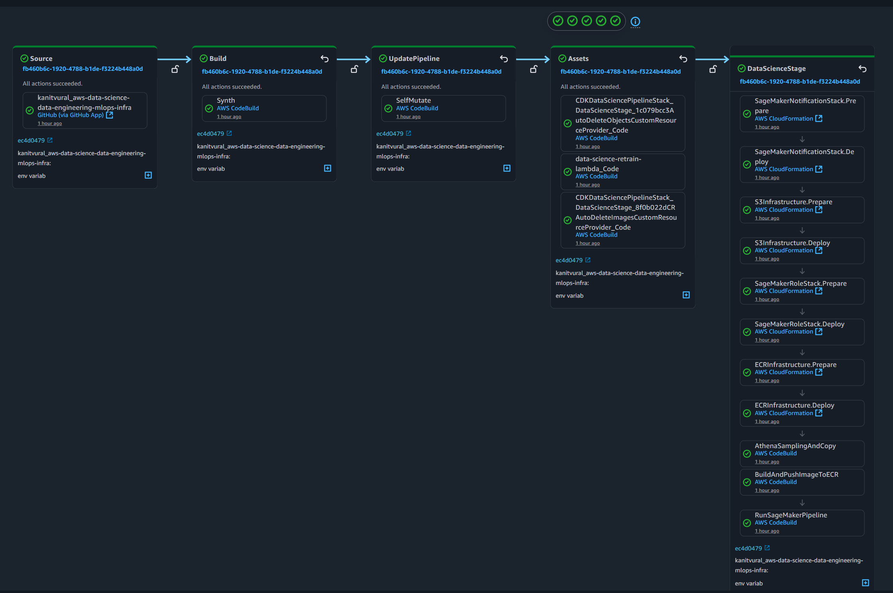

### Project Structure

```
data_science/
├── cdk_pipeline/
│   ├── cdk_data_science_pipeline.py
│   └── data_science_stage.py
├── stacks/
│   ├── ecr_stack.py
│   ├── sagemaker_role_stack.py
│   ├── s3_lambda_stack.py
│   └── sns_stack.py
├── train_container/
│   ├── Dockerfile
│   ├── requirements.txt
│   ├── train.py
│   └── train_mlflow.py
├── scripts/
│   ├── sm_pipeline.py
│   ├── athena_query.py
│   ├── preprocess.py
│   ├── evaluate.py
│   ├── evaluate_success.py
│   └── evaluate_failure.py
├── lambda_funcs/
│   └── retrain_model/
├── notebook/
│   ├── flights_experiments.ipynb
│   └── requirements.txt
├── tests/
│   └── unit_test/
│       ├── input/
│       ├── model/
│       └── output/
└── sm_clarify_analysis/
    └── clarify_pre_train/
        ├── report.html
        ├── report.pdf
        └── analysis.json
```

**Pipeline Flow:**
1. **Data Scientist** runs Athena SQL query for stratified sampling
2. **SageMaker Processing Job** performs feature engineering and train/val/test split
3. **SageMaker Clarify** analyzes pre-training bias (runs in parallel)
4. **Hyperparameter Tuning Job** finds optimal XGBoost parameters
5. **Final Training Job** uses best params on combined train+val data
6. **Conditional Step** checks if RMSE < 15
7. **Save Final Model** to S3 (only if RMSE threshold met)
8. **SNS Notification** alerts MLOps team

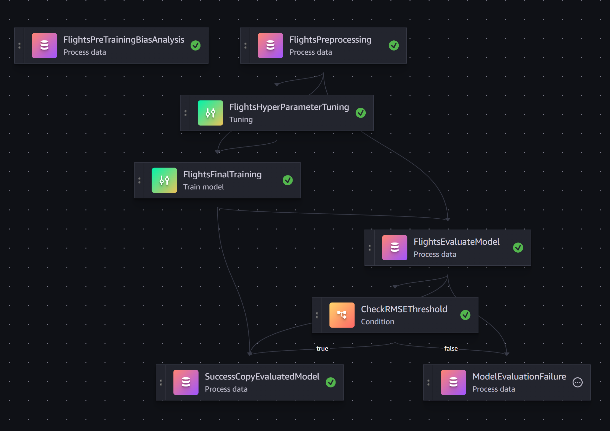

### ML Problem

**Objective:** Predict flight departure delay (`dep_delay`) in minutes

**Model:** XGBoost Regression

**Features:** 28 input features (temporal, flight details, weather conditions)

**Success Criteria:** RMSE < 15 minutes

### Jupyter Notebook

All exploratory data analysis and model prototyping:

📓 **[data_science/notebook/flights_experiments.ipynb](./data_science/notebook/flights_experiments.ipynb)**

This notebook includes:
- Data exploration and visualization
- Feature engineering experiments
- Baseline model development
- XGBoost hyperparameter testing
- Feature importance analysis


### Local Container Testing

```bash
cd data_science/train_container

# Login to ECR
aws ecr get-login-password --region eu-central-1 | \
  docker login --username AWS --password-stdin <YOUR-ACCOUNT-ID>.dkr.ecr.eu-central-1.amazonaws.com

# Build training image
docker build -f Dockerfile -t xgboost:1.0 .

# Test locally
cd ../tests/unit_test

docker run --rm --name 'my_model' \
    -v "$PWD/model:/opt/ml/model" \
    -v "$PWD/output:/opt/ml/output" \
    -v "$PWD/input:/opt/ml/input" \
    xgboost:1.0
```

**Expected Output:**
- `model/xgboost-model.json` - Trained model
- `model/feature_importance.json` - Feature importances
- `output/evaluation.json` - Training metrics

### Deployment

```bash
git switch datascience
make bootstrap env=ds
make deploy env=ds
```

**Deployment Time:** ~25-35 minutes

### Email Notification

When SageMaker Pipeline completes successfully, MLOps team receives email with:

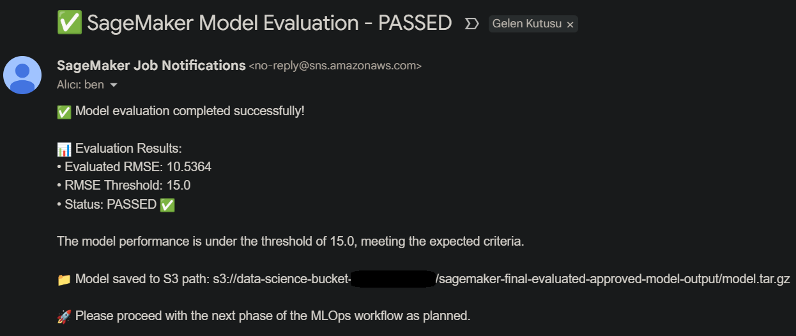


### Cleanup

```bash
make destroy env=ds
```

**⚠️ Manual Cleanup:** If CloudFormation stack deletion fails due to a missing IAM role, follow these steps:

1. Copy the name of the missing IAM role from the error message.
2. Go to the **AWS Console → IAM** and create or update the role with **AdministratorAccess** permissions.
3. Attach the role to **CloudFormation**.
4. Retry deleting the stack in **CloudFormation**.

---

## 🚀 MLOps


### Overview

The MLOps infrastructure implements a multi-stage deployment strategy with automated testing, monitoring, SHAP analysis, and retraining capabilities. The XGBoost model, evaluated and approved by data scientists, is stored as a finalized model artifact in Amazon S3 and then embedded into a FastAPI-based inference container, which is deployed to the SageMaker development endpoint. During the initial testing phase, the model is validated using the test.csv dataset generated during the SageMaker Processing Job in the data science workflow; however, in real-world scenarios, evaluating with alternative or unseen datasets would be more appropriate for robust validation.

The development endpoint is automatically tested using AWS Step Functions in a batch processing workflow. If the tests pass successfully, the model is registered in the SageMaker Model Registry, and baseline JSON files required for model monitoring are generated. The validated model is then deployed to a production endpoint with autoscaling enabled, enabling real-time inference in a production-like environment.

To simulate data drift, data quality degradation, and the need for model retraining, intentionally altered and statistically corrupted data is injected into the system through the web application using EC2-simulated inputs. These corrupted data samples are delivered to the MLOps S3 bucket via Kinesis Firehose in a partitioned structure. A Python automation script converts this data into CSV format and writes it to the data science bucket as `new_predictions.csv`, which automatically triggers the retraining pipeline. The pipeline merges the new data with historical training data, shuffles the dataset, and initiates a new training cycle to maintain model accuracy and reliability over time.

**⚠️ Note:** In this project, model monitoring, SHAP analysis, and retraining workflows require manual approval steps to prevent unnecessary system complexity during development. However, in a production environment, these three stages should be orchestrated as independent automated pipelines to support continuous delivery of ML improvements. The AWS CDK-based project structure is designed to easily support such extensions in future iterations.

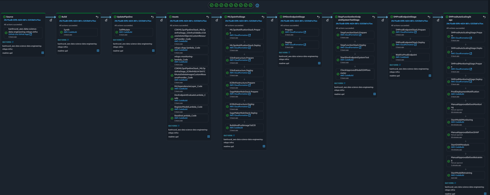

### Project Structure

```
mlops/
├── cdk_pipeline/
│   ├── cdk_mlops_pipeline.py
│   ├── mlops_infra_stage.py
│   ├── sm_dev_endpoint_stage.py
│   ├── sm_prod_endpoint_stage.py
│   ├── sm_prod_autoscaling_stage.py
│   └── step_function_stage.py
├── stacks/
│   ├── ecr_stack.py
│   ├── sagemaker_role_stack.py
│   ├── sm_dev_endpoint_stack.py
│   ├── sm_prod_endpoint_stack.py
│   ├── sm_prod_autoscaling_stack.py
│   ├── sm_monitoring_stack.py
│   ├── step_function_stack.py
│   ├── s3_lambda_stack.py
│   └── sns_stack.py
├── inference_container/
│   ├── Dockerfile
│   ├── requirements.txt
│   ├── inference.py
│   ├── server.py
│   ├── wsgi.py
│   └── nginx.conf
├── lambda_funcs/
│   ├── evaluate_dev_endpoint/
│   ├── register_model/
│   ├── model_monitor/
│   ├── shap_report/
│   └── sm_baseline_processing/
├── scripts/
│   ├── check_model_registry.py
│   ├── execute_state_machine.py
│   ├── prepare_retrain_data_and_send_to_ds_bucket.py
│   ├── send_prod_deployment_notification.py
│   ├── start_model_monitoring.py
│   ├── start_shap_analysis.py
│   └── wait_for_endpoint.py
├── tests/
│   ├── local_test/
│   ├── dev_endpoint_system_test/
│   └── prod_endpoint_load_test/
└── prod_endpoint_reports/
    ├── model_monitor/
    └── shap/
```

**Workflow:**
1. **Dev Endpoint Deployment** - Final model from data science deployed to dev
2. **Step Functions Execution** - Automated batch predictions and baseline generation
3. **Model Registry** - Successful models registered with version control
4. **Production Endpoint** - Deploy with auto-scaling (ml.c5.xlarge, 1-5 instances)
5. **SNS Notification** - Production deployment confirmation
6. **Manual Approval #1** - Start model monitoring
7. **Model Monitoring** - Data drift and quality checks
8. **SNS Notification** - Monitoring report with drift metrics
9.  **Manual Approval #2** - Start SHAP analysis
10. **SHAP Analysis** - Model explainability report
11. **SNS Notification** - SHAP analysis complete
12. **Manual Approval #3** - Trigger retraining
13. **SNS Notification** - Notification to Data Scientists

**Innovation:** Uses **custom FastAPI inference container** instead of Flask for better performance.

### Step Functions Execution

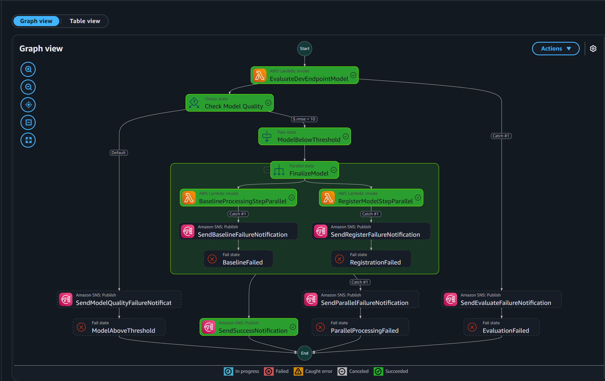

### Model Monitoring

📊 **QUICK STATS**  
━━━━━━━━━━━━━━━━━━━━━━━━  
🔢 Total Issues: 13  
🔍 Data Quality Issues: 7  
📈 Drift Issues: 6  

These issues were detected during model monitoring. After the **retraining process**, the monitoring results showed a decrease in these values:

📊 **QUICK STATS**  
━━━━━━━━━━━━━━━━━━━━━━━━  
🔢 Total Issues: 9  
🔍 Data Quality Issues: 6  
📈 Drift Issues: 3  

This simulates the detection of drift and data quality issues and their correction through retraining.


### Local Container Testing

```bash
cd mlops/inference_container

# Login to ECR
aws ecr get-login-password --region eu-central-1 | \
  docker login --username AWS --password-stdin <YOUR-ACCOUNT-ID>.dkr.ecr.eu-central-1.amazonaws.com

# Build inference image
docker build -f Dockerfile -t xgboost-inference:1.0 .

cd ../tests/local_test
```

**Test Prediction:**
```bash
docker run --rm --name 'xgb_model' \
  -v "$PWD/model:/opt/ml/model" \
  xgboost-inference:1.0 --mode=test \
  --input_data="2022,6,29,-13.0,399,12,36,54.0,92.92,200.0,8.05546,0.0001,1021.4,10.0,0.06324238003505211,0,272,0,0,0,0,0,0,0,1,0,0,0"
```

**Test API:**
```bash
# Start server
docker run --rm --name 'xgb_model' -p 8080:8080 \
  -v "$PWD/model:/opt/ml/model" \
  xgboost-inference:1.0

# Test with Python
python server_test.py

# Test with curl
curl -X POST http://localhost:8080/invocations \
  -H "Content-Type: text/csv" \
  --data "2022,6,29,-13.0,399,12,36,54.0,92.92,200.0,8.05546,0.0001,1021.4,10.0,0.06324238003505211,0,272,0,0,0,0,0,0,0,1,0,0,0"
```

### Deployment

```bash
git switch mlops
make bootstrap env=mlops
make deploy env=mlops
```

**Deployment Time:** ~30-40 minutes

### Dev Endpoint System Test

Test dev endpoint with batch predictions:

```bash
cd mlops/tests/dev_endpoint_system_test
python dev_endpoint_local_test.py
```

**Configuration:**
- `ENDPOINT_NAME = "mlops-dev-endpoint"`
- `TEST_DATA_S3_BUCKET = "data-science-bucket-<YOUR-ACCOUNT-ID>"`
- `EVALUATION_RESULT_S3_BUCKET = "mlops-bucket-<YOUR-ACCOUNT-ID>"`
- `TEST_CSV_KEY = "sagemaker-preprocess-output/test/test.csv"`
- `TARGET_COLUMN = "dep_delay"`
- `RMSE_THRESHOLD = 20.0`

### Production Load Test

Test auto-scaling with high traffic:

```bash
cd mlops/tests/prod_endpoint_load_test
python prod_load_test.py
```

**Expected Behavior:**
- **0-5 min:** 1 instance, latency ~50ms
- **5-10 min:** Scale to 2 instances
- **10-15 min:** Scale to 3 instances
- **25-30 min:** Scale down to 1 instance

### Monitoring CloudWatch Metrics

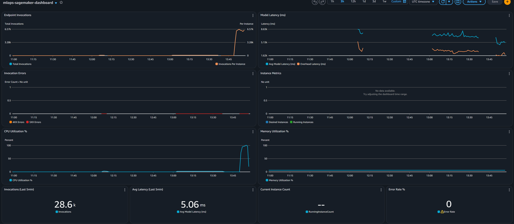

**CloudWatch Metrics:**
1. Go to **CloudWatch** → **Dashboards** → `MLOps-Production-Dashboard`

Monitoring metrics:
  - `Invocations` - Shows the total number of prediction requests made to the endpoint.
  - `InvocationsPerInstance` - Measures the average number of requests processed per second by each instance.
  - `InvocationErrors` - Tracks the total number of failed prediction requests and error rate.
  - `ModelLatency` - Indicates the time taken by the model to complete a prediction in milliseconds.
  - `CPUUtilization` - Monitors the CPU usage percentage of endpoint instances.
  - `MemoryUtilization` - Tracks the memory usage percentage of endpoint instances.


### Email Notification

- When Step functions execution finishes, you receive email with:

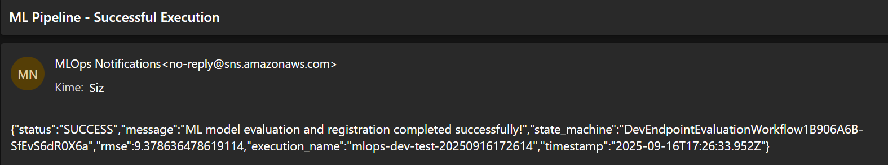

- When production endpoint deploys, you receive email with:
  
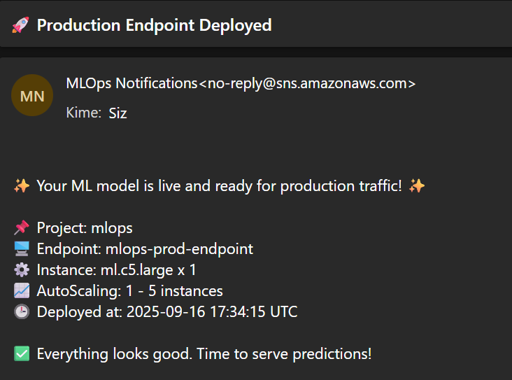

- When Model Monitor detects data drift or data quality issues, you receive an alert email:

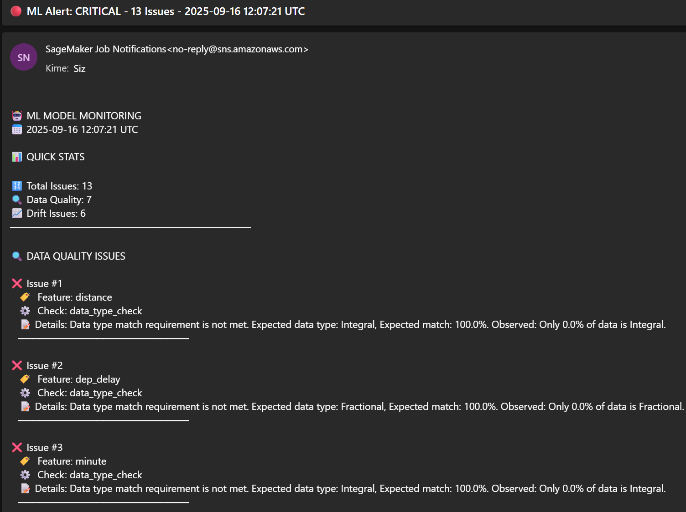

- When SHAP analysis is completed for model explainability, you receive a model insights report via email:

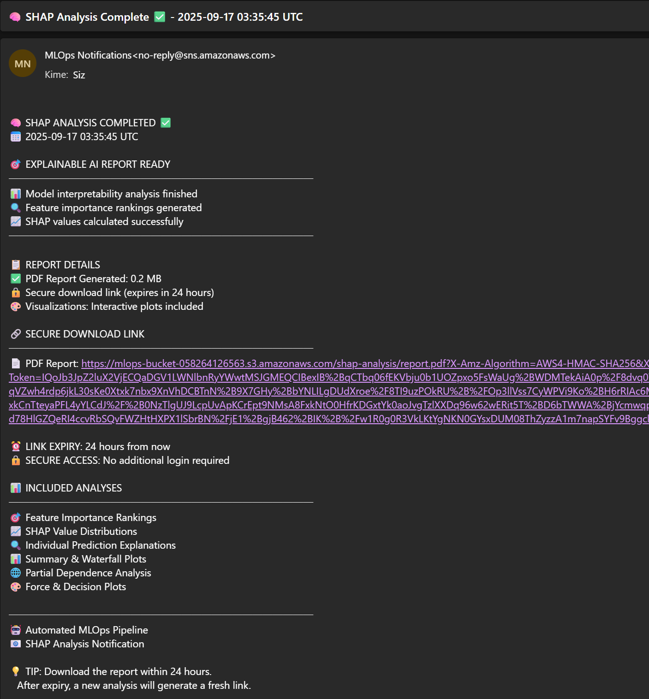

- When the Retraining pipeline is automatically triggered, you receive a pipeline execution notification:

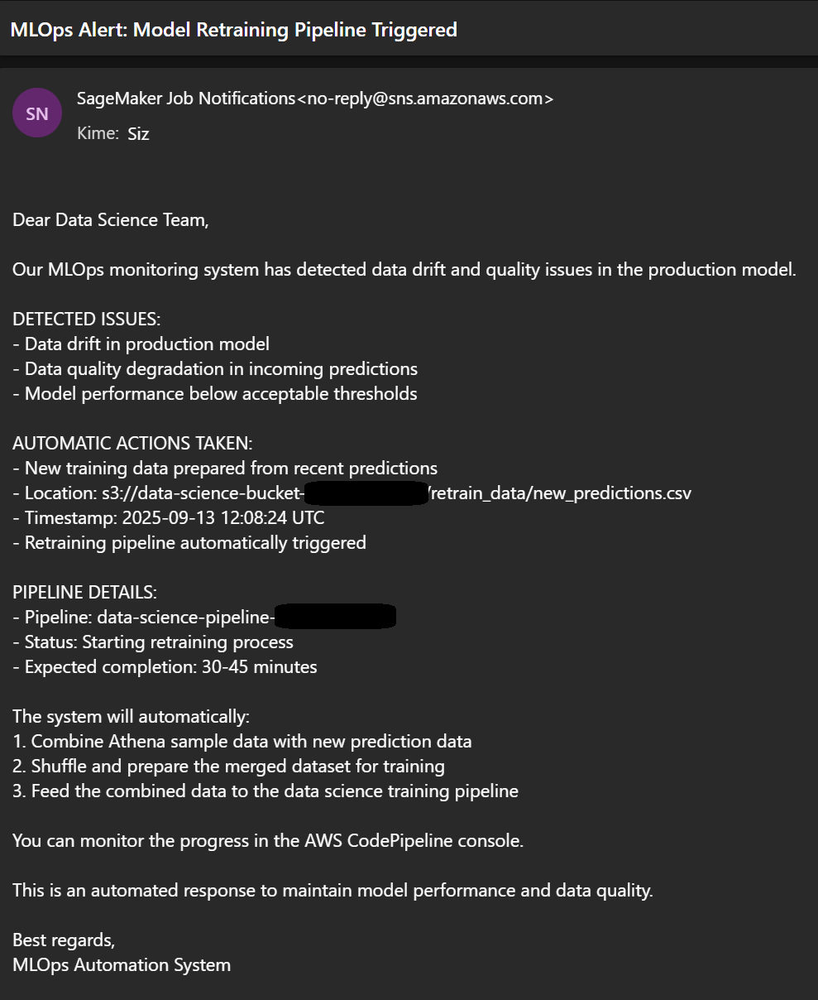

- After retraining, you receive the **same type of email again**, showing that the issues have been reduced:

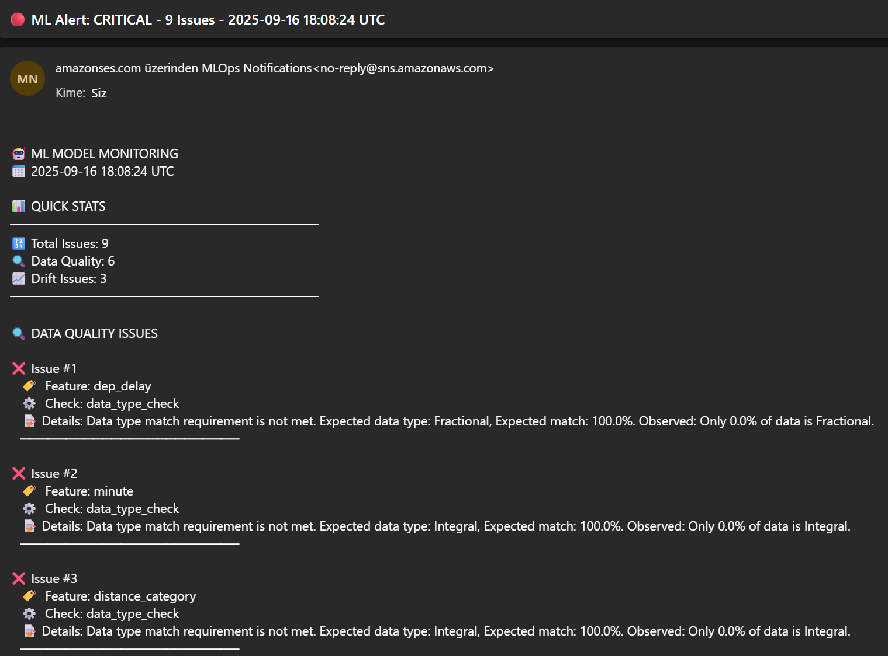


### Cleanup

```bash
make destroy env=mlops
```

**⚠️ Manual Cleanup:** If CloudFormation stack deletion fails due to a missing IAM role, follow these steps:

1. Copy the name of the missing IAM role from the error message.
2. Go to the **AWS Console → IAM** and create or update the role with **AdministratorAccess** permissions.
3. Attach the role to **CloudFormation**.
4. Retry deleting the stack in **CloudFormation**.

---

## 🌐 Full-Stack Web Application

### Overview

The web application provides a modern, serverless interface for real-time flight predictions and monitoring. It demonstrates how to build cost-effective, scalable applications using AWS serverless services.

### System Architecture Overview — Consists of 3 Core Components

### 1. EC2 Data Simulator, Real-Time Prediction & API Gateway WebSocket

A Python-based **data simulator** running on **Amazon EC2** generates streaming data using a statistically corrupted test dataset to simulate **data drift** in production. Following **loose coupling architecture principles**, data flows through Amazon Kinesis streams:

- Raw flight data is published to **Kinesis Raw Stream**
- A Lambda function performs **real-time processing** → **Kinesis Processed Stream**
- Another Lambda performs **real-time inference** using the **SageMaker Production Endpoint** → **Kinesis Predicted Stream**
- Predictions are delivered to Amazon S3 `mlops` bucket via **Kinesis Firehose** (partitioned format)
- A scheduled Python script converts streamed data to CSV and stores it in the **Data Science S3 bucket** to **trigger the retraining pipeline**

In parallel:

- Data is written to **DynamoDB Raw Table** with `dep_delay` initially set to `NULL`
- After real-time prediction, a Lambda updates the record with prediction results
- **DynamoDB Streams** send updates to **API Gateway WebSocket**
- Real-time updates are displayed on the **Flight Dashboard frontend**
- Outdated data is automatically removed using **DynamoDB TTL (1 hour expiry)**

---

### 2. API Gateway REST API, DynamoDB Sessions, Cognito User Pools & Secure Authentication

- Users register and log in through **Amazon Cognito User Pools**
- **HttpOnly secure cookies** are used for authentication to prevent token access from JavaScript
- Architecture uses **1-hour access tokens + 24-hour refresh tokens**
- **API Gateway REST API** protects backend services via Lambda authorizers
- Fully serverless and secure authentication and authorization architecture
- This REST API is also used by the **Multi-Agent LLM system**. The `/chat` and `/history` endpoints communicate with the **Amazon Bedrock Agent Core** endpoint, enabling AI-powered interaction within the platform.
- For **history and session management**, when a user logs in, a new session record is created in **DynamoDB Sessions** with the login timestamp. When the user logs out, the session is deleted. If the user closes the application without logging out, the session is automatically removed after **1 hour** using **TTL (Time To Live)**.

---

### 3. Next.js Frontend with S3 + CloudFront Deployment

- Built using **Next.js 15** with:
  - Modern authentication UI
  - **Live Flight Delay Monitoring Dashboard**
  - Integrated **AI-powered chatbot**
- Deployed using **Static Site Generation (SSG)** to **Amazon S3**
- Distributed globally and securely using **Amazon CloudFront CDN**
- Deployed automatically with **AWS CodeBuild** → static files uploaded to S3

---


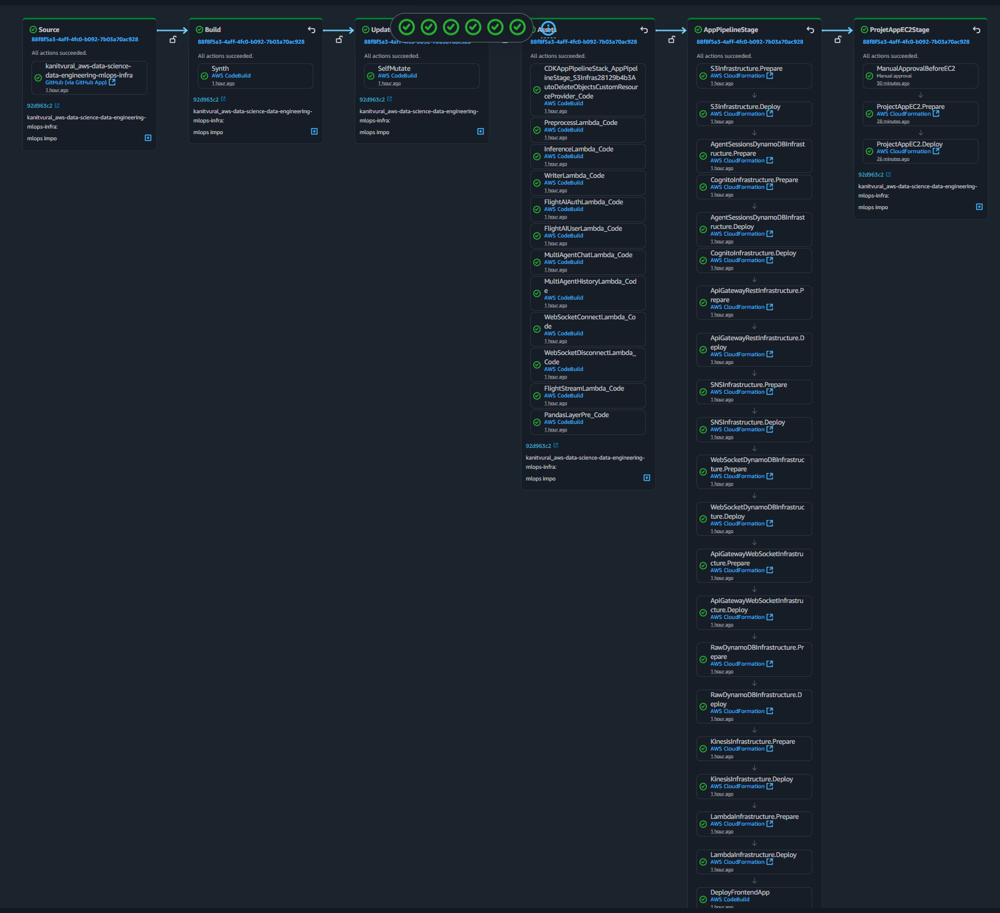

### Project Structure

```
project_app/
├── cdk_pipeline/
│   ├── cdk_app_pipeline.py
│   ├── project_app_stage.py
│   └── ec2_stage.py
├── stacks/
│   ├── s3_stack.py
│   ├── kinesis_stack.py
│   ├── raw_dynamodb_stack.py
│   ├── agent_sessions_dynamodb_stack.py
│   ├── websocket_dynamodb_stack.py
│   ├── lambda_stack.py
│   ├── api_gateway_rest_stack.py
│   ├── api_gateway_websocket_stack.py
│   ├── cognito_stack.py
│   ├── ec2_stack.py
│   └── sns_stack.py
├── frontend/
│   └── flight-dashboard/
│       ├── src/
│       │   ├── app/
│       │   │   ├── (auth)/login/
│       │   │   ├── (home)/
│       │   │   ├── layout.tsx
│       │   │   └── globals.css
│       │   ├── components/
│       │   │   ├── FlightDashboard.tsx
│       │   │   ├── FlightGrid.tsx
│       │   │   ├── Chatbot.tsx
│       │   │   ├── ThemeToggle.tsx
│       │   │   └── LogoutButton.tsx
│       │   ├── contexts/
│       │   │   ├── AuthContext.tsx
│       │   │   └── ThemeContext.tsx
│       │   ├── services/
│       │   │   └── restApiService.ts
│       │   └── types/
│       │       └── flight.ts
│       ├── package.json
│       └── next.config.ts
├── lambda_funcs/
│   ├── api_gateway_rest_lambdas/
│   │   ├── flightai_auth_lambda/
│   │   ├── flightai_user_lambda/
│   │   ├── agent_chat_lambda/
│   │   └── agent_history_lambda/
│   ├── api_gateway_websocket_lambdas/
│   │   ├── connect/
│   │   ├── disconnect/
│   │   └── flight_dynamodb_stream_lambda/
│   ├── inference_lambda/
│   ├── preprocess_lambda/
│   └── writer_lambda/
├── scripts/
│   ├── generate_env_local.py
│   └── cloudfront_cache_invalidation.py
└── test/
    └── README.md
```

**Workflow:**
1. **Data Flow:** EC2 sends corrupted test data → Kinesis → Lambda (preprocess) → SageMaker endpoint
2. **Dual Write:** Raw data goes to both DynamoDB and Kinesis
3. **Real-Time Processing:** Lambda processes data, invokes endpoint, captures predictions
4. **Storage:** Predictions stored in DynamoDB (TTL: 1 hour) and S3 (via Firehose)
5. **Live Updates:** DynamoDB Streams → WebSocket API → Frontend dashboard
6. **Frontend:** Next.js 15 SSG hosted on S3 + CloudFront
7. **Authentication:** Cognito with HTTP-only cookies (1h access token, 24h refresh token)

**Why Serverless for Startups:**

✅ **Advantages:**
- Pay-per-request (very low fixed costs)
- Auto-scales automatically
- No server management
- Global CDN with CloudFront

❌ **Disadvantages (at scale):**
- Becomes expensive at millions of requests/day
- Cold starts can add latency

**Migration Strategy:** When traffic exceeds 100K requests/day, migrate to **ECS Fargate** or **EKS** for 70% cost reduction.

### Deployment

```bash
git switch app
make bootstrap env=app
make deploy env=app
```

**Deployment Time:** ~35-45 minutes

**Next.js Build:**
- CodeBuild runs `npm run build`
- Static files uploaded to S3
- CloudFront cache invalidated


### Local Test & Development

**Generate Environment Variables:**
```bash
cd project_app/scripts
python generate_env_local.py
```

This creates `.env.local` with API Gateway endpoints and Cognito configuration.

**Install Dependencies:**
```bash
cd project_app/frontend/flight-dashboard
npm install
```

**Run Development Server:**
```bash
npm run dev
```

Application runs at `http://localhost:3000`

**CORS Configuration:**

API Gateway REST API allows both CloudFront URL and localhost:

```python
# In api_gateway_rest_stack.py
default_cors_preflight_options=apigw.CorsOptions(
    allow_origins=[cloudfront_url, localhost_url],
    allow_methods=["GET", "POST", "OPTIONS"],
    allow_headers=[
        "Content-Type",
        "Cookie",
        "Authorization",
        "X-Amz-Date",
        "X-Api-Key",
        "X-Amz-Security-Token",
    ],
    allow_credentials=True,
),
```

### Email Notification

When deployment completes, you receive email with:

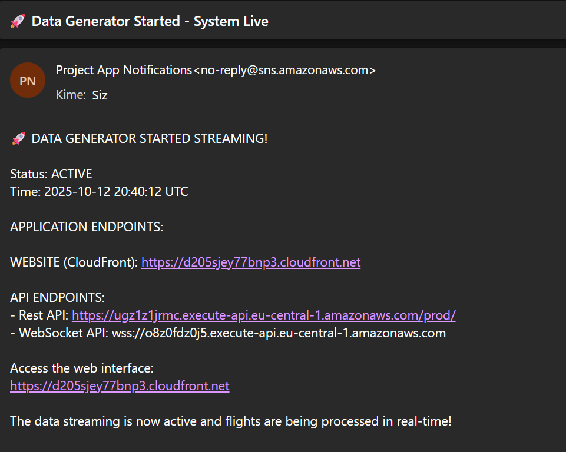


### Application Screenshots

<p align="center">
  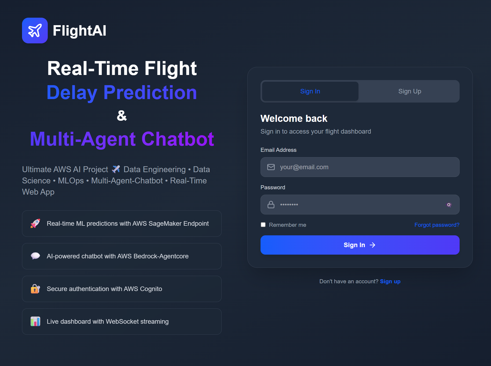
  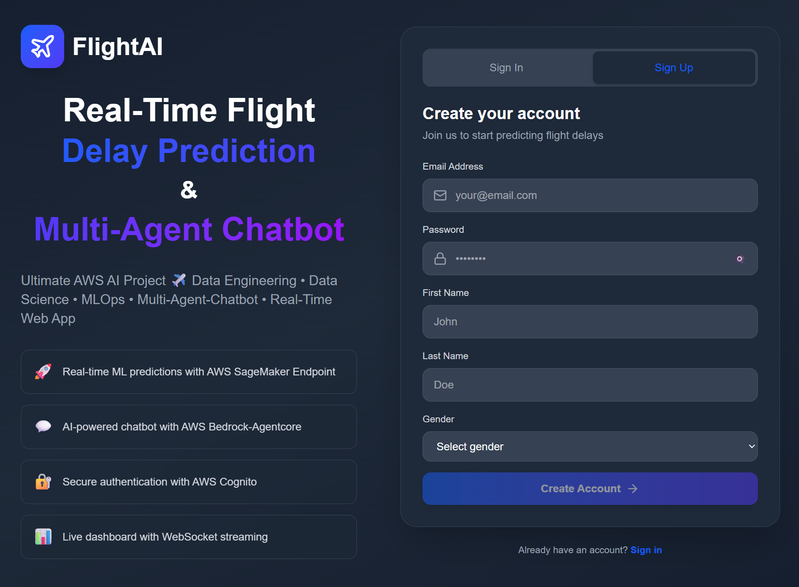
</p>

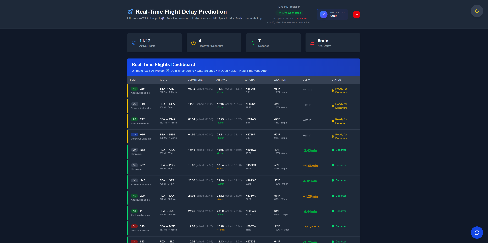

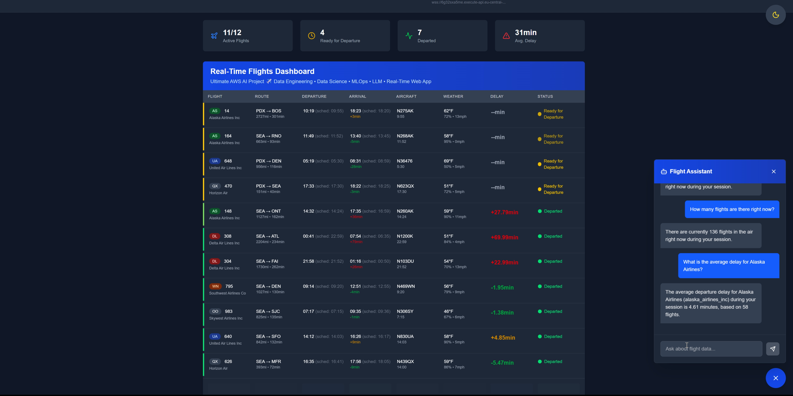

### Cleanup

```bash
make destroy env=app
```

**⚠️ Manual Cleanup:** If CloudFormation stack deletion fails due to a missing IAM role, follow these steps:

1. Copy the name of the missing IAM role from the error message.
2. Go to the **AWS Console → IAM** and create or update the role with **AdministratorAccess** permissions.
3. Attach the role to **CloudFormation**.
4. Retry deleting the stack in **CloudFormation**.

---

## 🤖 Multi-Agent LLM


### Overview

The multi-agent LLM system provides an intelligent chatbot that can answer questions about the project and query real-time flight statistics using Amazon Bedrock Agent Core Starter Toolkit and OpenAI.

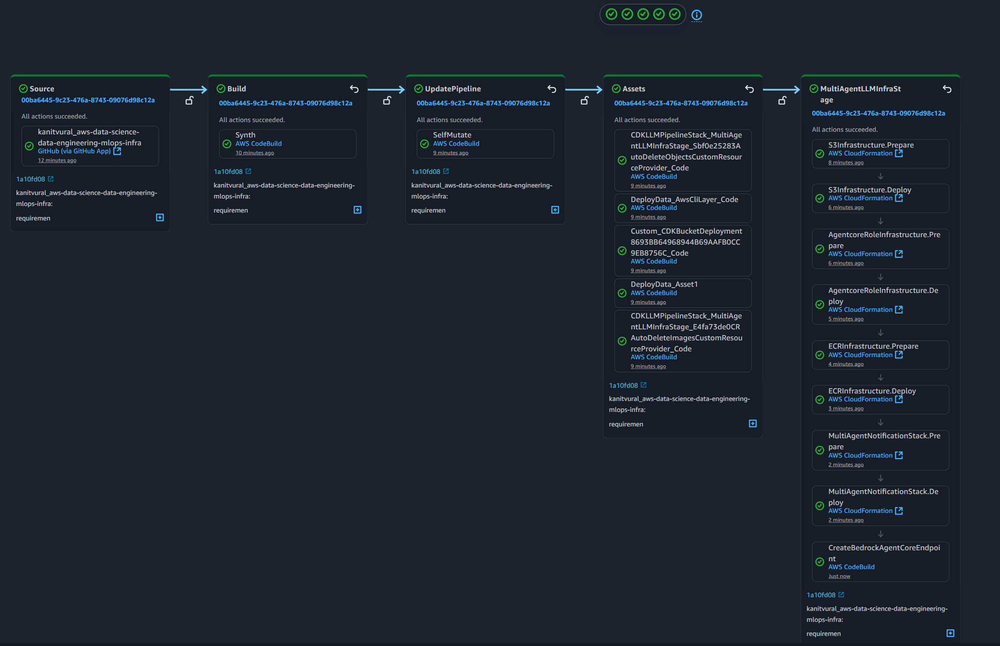

### Project Structure

```
multi_agent_llm/
├── cdk_pipeline/
│   ├── cdk_multi_agent_llm_pipeline.py
│   └── multi_agent_llm_stage.py
├── stacks/
│   ├── ecr_stack.py
│   ├── agent_core_role_stack.py
│   ├── s3_stack.py
│   └── sns_stack.py
├── core/
│   ├── Dockerfile
│   ├── requirements.txt
│   ├── flight_multi_agent.py
│   ├── test_flight_multi_agent.py
│   └── utils/
│       ├── create_openai_vector_store.py
│       └── load_flight_data_dynamodb.py
├── data/
│   └── README.md
├── scripts/
│   └── send_prod_deployment_notification.py
└── lambda_funcs/
    └── backup/
```

**Capabilities:**
1. **Project Documentation Q&A** - Uses OpenAI vector store with project README
2. **Real-Time Flight Statistics** - Queries DynamoDB for live flight data
3. **Content Filtering & Privacy Protection** - Guardrail agent filters personal information requests and redirects to kanitvural.com

**Key Features:**

| Feature | Description |
|---------|-------------|
| **Session Management** | Backend creates session in **DynamoDB** on login with timestamp |
| **Rate Limiting** | 20 requests per minute per user |
| **Token-Session Sync** | 1-hour TTL, auto-extends on activity |
| **Multi-Agent System** | Supervisor routes to Project Info or Flight Data agents |
| **DynamoDB GSI** | FlightsByTime index for optimized queries |
| **Pandas Filtering** | In-memory statistical computations |
| **Logout Cleanup** | Session deletion + token revocation |
| **Guardrail** | Redirects conversations about Kanıt Vural to [kanitvural.com](https://kanitvural.com) |

**Agent Architecture:**

```
User Question
     ↓
Supervisor Agent (Bedrock Agent Core)
     ↓
   Routes to:
     ├─→ Project Info Agent (OpenAI Vector Store)
     │   • Searches project documentation
     │   • Returns relevant sections
     │
     ├─→ Flight Data Agent (DynamoDB + Pandas)
     │   • Queries DynamoDB with GSI
     │   • Filters by session timestamp
     │   • Performs statistical analysis
     │
     └─→ Guardrail Agent (Content Filtering - Handoff)
         • Filters personal information requests
         • Redirects to: kanitvural.com
         • Blocks unauthorized personal queries
```

## Flight Data Agent Tool – Additional Information

When a user logs in:

1. **Session Initialization:**
   - Backend creates `session_id` and stores initial `timestamp`
   - `last_activity` is set to the same timestamp as session creation

2. **Data Ingestion:**
   - EC2 adds `partition_key="FLIGHTS"` and `timestamp` to each flight record in the streaming data

3. **User Interaction & Activity Tracking:**
   - When user submits a prompt, `last_activity` is updated to the current timestamp
   - Both `session_timestamp` (start) and `last_activity` (end) are passed to the agent's tool

4. **Query Execution:**
   - Agent queries DynamoDB using the session's time window:
```python
   # DynamoDB GSI Query
   response = dynamodb_client.query(
       TableName='raw-flights',
       IndexName='FlightsByTime',
       KeyConditionExpression='data_type = :pk AND #ts BETWEEN :start AND :end',
       ExpressionAttributeNames={'#ts': 'timestamp'},
       ExpressionAttributeValues={
           ':pk': {'S': 'FLIGHTS'},
           ':start': {'N': str(session_timestamp)},  # User's login time
           ':end': {'N': str(last_activity)}  # Current prompt time
       }
   )
```

5. **Data Processing & Filtering:**
```python
   items = response.get('Items', [])
   logger.info(f"✅ Retrieved {len(items)} items from DynamoDB")
   
   if not items:
       logger.warning("⚠️  No items found in time window")
       return pd.DataFrame()
   
   # Parse DynamoDB items to Python dict
   parsed_items = []
   for item in items:
       parsed = {}
       for key, value in item.items():
           if 'S' in value:
               parsed[key] = value['S']
           elif 'N' in value:
               parsed[key] = float(value['N'])
           elif 'NULL' in value:
               parsed[key] = None
       parsed_items.append(parsed)
   
   # Create DataFrame
   df = pd.DataFrame(parsed_items)
   
   # ✅ Filter only predicted flights (dep_delay is not NULL)
   df_predicted = df[df['dep_delay'].notna()]
   logger.info(f"📊 After filtering predicted flights: {len(df_predicted)} records (filtered out {len(df) - len(df_predicted)} unpredicted)")
   
   return df_predicted
```

6. **Result:** 
   - User only sees flights from their session window (isolated data)
   - Query filters streaming data precisely between login and current activity timestamps


### Benefits

- **Data Isolation:** Each user session queries only its relevant time window
- **Real-time Access:** Users can query streaming data as it arrives
- **Efficient Queries:** Time-based filtering reduces DynamoDB scan costs
- **Session Continuity:** All prompts within a session access cumulative data from login time
- **Hybrid Query System:** Hybrid DynamoDB-Pandas approach enables sophisticated data filtering without complex NoSQL syntax

### Local Testing

**Environment Setup:**
```bash
cd multi_agent_llm/core
python -m venv venv
source venv/bin/activate  # Linux/macOS
pip install -r requirements.txt
```

**Store OpenAI API Key:**
```bash
aws ssm put-parameter \
  --name "/multi-agent-llm/openai-api-key" \
  --value "sk-..." \
  --type "String" \
  --overwrite
```

**Create OpenAI Vector Store:**
```bash
python utils/create_openai_vector_store.py
```

This uploads the project README to OpenAI vector store for semantic search.

**Run Tests:**
```bash
# Automated test suite
python test_flight_multi_agent.py

# Interactive chat mode
python test_flight_multi_agent.py interactive

# Check DynamoDB data
python test_flight_multi_agent.py check
```

**Example Interaction:**
```
You: How does the MLOps pipeline work?
Agent: The MLOps pipeline implements a multi-stage deployment strategy. 
       First, models are deployed to a dev endpoint for validation. After 
       automated testing with Step Functions, successful models are 
       registered. Following manual approval, they're deployed to production 
       with auto-scaling...

You: What's the average delay for Alaska Airlines?
Agent: Based on current session data, Alaska Airlines has an average 
       departure delay of 8.3 minutes across 42 flights.

You: How many flights from PDX to ORD?
Agent: There are 3 flights on the PDX→ORD route with an average 
       predicted delay of 6.7 minutes.
```

### Deployment

```bash
git switch llm
make bootstrap env=llm
make deploy env=llm
```

**Deployment Time:** ~20-30 minutes

### Monitoring

`AWS Console Home > CloudWatch > GenAI Observability`  

Here, agents can be monitored via **Bedrock Agent Core**.

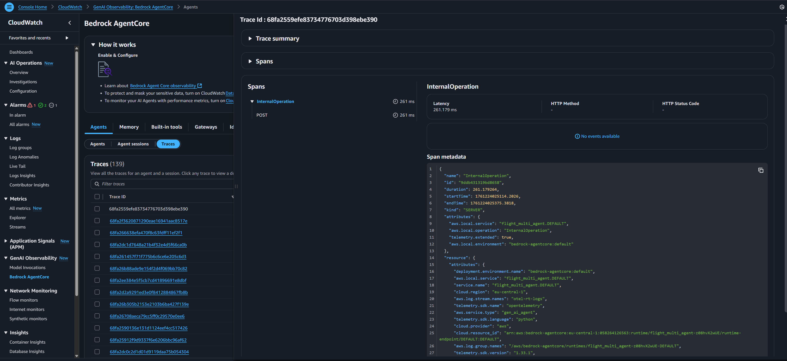


### Email Notification

When deployment completes, you receive email with:

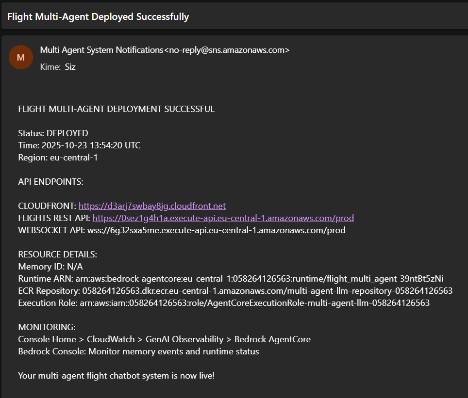

### Cleanup

```bash
make destroy env=llm
```

**⚠️ Manual Cleanup:** If CloudFormation stack deletion fails due to a missing IAM role, follow these steps:

1. Copy the name of the missing IAM role from the error message.
2. Go to the **AWS Console → IAM** and create or update the role with **AdministratorAccess** permissions.
3. Attach the role to **CloudFormation**.
4. Retry deleting the stack in **CloudFormation**.
5. To manually delete the Bedrock Agent Core resources:
   - Go to **AWS Console → Amazon Bedrock Agent Core → Agent Runtime** and delete the `flight_multi_agent` endpoint.
   - Go to **AWS Console → Amazon Bedrock Agent Core → Memory** and delete the `flight_multi_agent_memory`.
   - Empty S3 buckets and delete
   - Delete OpenAI vector store (if no longer needed)

---

## 🧹 General Cleanup Order

### Component-by-Component Cleanup

**Recommended Order:** (to avoid dependency issues)

1. Multi-Agent LLM
2. Web Application  
3. MLOps
4. Data Science
5. Data Engineering


### Verification

Check for remaining resources:

```bash
# CloudFormation stacks
aws cloudformation list-stacks \
  --stack-status-filter CREATE_COMPLETE UPDATE_COMPLETE \
  --query 'StackSummaries[].StackName'

# S3 buckets
aws s3 ls | grep -E "(data-engineering|data-science|mlops|project-app|multi-agent)"

# Running EC2 instances
aws ec2 describe-instances \
  --filters "Name=tag:Project,Values=aws-data-ml-platform" \
  --query 'Reservations[].Instances[?State.Name==`running`].InstanceId'

# SageMaker endpoints
aws sagemaker list-endpoints

# Bedrock Agents
aws bedrock-agent list-agents
```

**Estimated Total Cleanup Time:** 60-90 minutes

### 🔧 Troubleshooting Cleanup Issues

1. Copy the name of the missing IAM role from the error message.

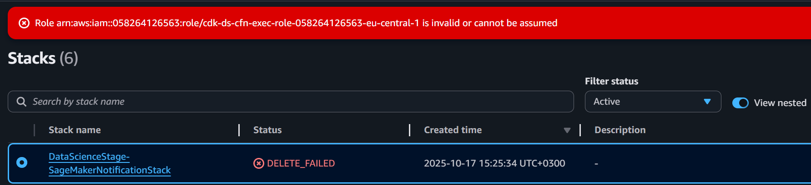

2. Go to the **AWS Console → IAM** and create or update the role with **AdministratorAccess** permissions.


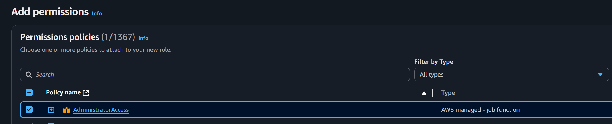

3. Retry deleting the stack in **CloudFormation**.


---

## 📜 License

This project is licensed under the **MIT License**.

```
MIT License

Copyright (c) 2025 Kanit Vural

Permission is hereby granted, free of charge, to any person obtaining a copy
of this software and associated documentation files (the "Software"), to deal
in the Software without restriction, including without limitation the rights
to use, copy, modify, merge, publish, distribute, sublicense, and/or sell
copies of the Software, and to permit persons to whom the Software is
furnished to do so, subject to the following conditions:

The above copyright notice and this permission notice shall be included in all
copies or substantial portions of the Software.

THE SOFTWARE IS PROVIDED "AS IS", WITHOUT WARRANTY OF ANY KIND, EXPRESS OR
IMPLIED, INCLUDING BUT NOT LIMITED TO THE WARRANTIES OF MERCHANTABILITY,
FITNESS FOR A PARTICULAR PURPOSE AND NONINFRINGEMENT. IN NO EVENT SHALL THE
AUTHORS OR COPYRIGHT HOLDERS BE LIABLE FOR ANY CLAIM, DAMAGES OR OTHER
LIABILITY, WHETHER IN AN ACTION OF CONTRACT, TORT OR OTHERWISE, ARISING FROM,
OUT OF OR IN CONNECTION WITH THE SOFTWARE OR THE USE OR OTHER DEALINGS IN THE
SOFTWARE.
```

---

## 📞 Contact

**Kanit Vural**

- 🌐 Website: [https://kanitvural.com/](https://kanitvural.com/)
- 📧 Email: [kanitvural@gmail.com](mailto:kanitvural@gmail.com)
- 💼 LinkedIn: [https://www.linkedin.com/in/kanitvural/](https://www.linkedin.com/in/kanitvural/)
- 📝 Medium: [https://medium.com/@kanitvural](https://medium.com/@kanitvural)

**Questions or Issues?**
- 🐛 Report bugs: [GitHub Issues](https://github.com/kanitvural/aws-data-science-data-engineering-mlops-infra/issues)
- 💬 Discussions: [GitHub Discussions](https://github.com/kanitvural/aws-data-science-data-engineering-mlops-infra/discussions)

---

<div align="center">

**Built with ❤️ on AWS**

**If you found this helpful, please ⭐ star the repository!**

</div>